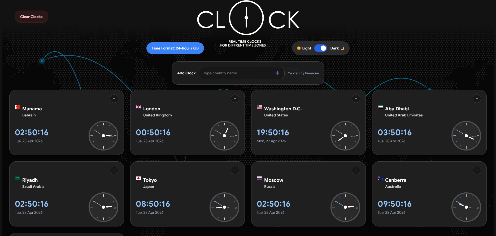

<h1 align="center" style="font-size: 48px;">World Clock</h1>

<br />




World Clock is a responsive time-zone dashboard built with React, Vite, and Tailwind CSS. It lets users track multiple live clocks from different countries and capital cities in one clean interface. Each clock card shows the local digital time, date, country flag, capital city, country name, and an analog clock face that updates in real time.

The app supports adding new clocks from a searchable country dropdown, removing individual clocks with a two-step confirmation button, clearing all selected clocks, switching between 12-hour and 24-hour formats, toggling light and dark themes, and reordering clock cards with drag and drop. Selected clocks and theme preferences are saved in local storage, so the dashboard stays consistent after refreshing the browser.

## Features

- Live digital and analog clocks for multiple time zones.
- Searchable country picker using local timezone and flag data.
- Individual clock removal with a click-to-confirm `X` state.
- Clear all clocks confirmation dialog.
- Drag-and-drop clock card reordering.
- 12-hour and 24-hour time format toggle.
- Light and dark theme support.
- Local storage persistence for selected clocks and theme mode.
- Responsive four-column desktop layout designed to show eight clocks clearly.
- Local Google Sans font usage with font weights for visual hierarchy.

## Project Structure

```text
world-clock/
|-- public/
|   |-- Google_Sans/
|   |-- app-pic.png
|   |-- favicon.svg
|   |-- logo-dark.png
|   |-- logo-light.png
|   `-- timezones_and_flags.json
|-- src/
|   |-- components/
|   |   |-- AddMoreCountries.jsx
|   |   |-- AnalogClock.jsx
|   |   |-- Clock.jsx
|   |   |-- ThemeSwitch.jsx
|   |   |-- ToggleTimeFormatButton.jsx
|   |   `-- WorldClock.jsx
|   |-- App.css
|   |-- App.jsx
|   |-- index.css
|   `-- main.jsx
|-- index.html
|-- package.json
|-- tailwind.config.js
`-- vite.config.js
```

## Getting Started

Install dependencies:

```bash
pnpm install
```

Run the development server:

```bash
pnpm dev
```

Open the local app in your browser:

```text
http://localhost:5173
```

Build the production version:

```bash
pnpm build
```

Preview the production build locally:

```bash
pnpm preview
```

## Deployment

This project is ready to deploy on Vercel. Use the default Vite settings:

- Build command: `pnpm build`
- Output directory: `dist`
- Install command: `pnpm install`

## Feedback

If you find a bug, notice incorrect timezone data, or have an idea for improving the app, please open an issue or submit a pull request with a clear description of the problem and the steps needed to reproduce it.
